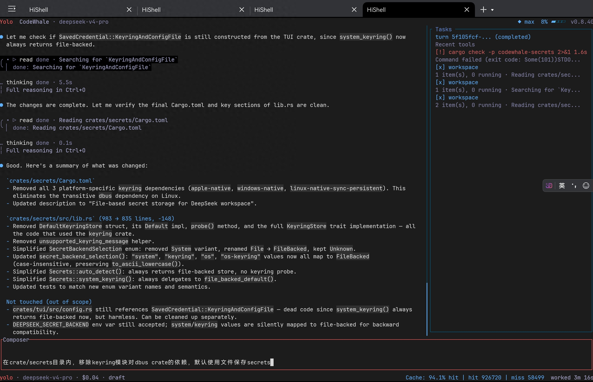

# 前言
鸿蒙 PC 入手快一年了，开发工具链也在持续完善。特别是今年 Rust 原生开发环境基本就绪，终于可以动手做些有意思的东西了——那就从当下最火的 AI Agent 开始吧！

需要说明的是：以下内容均聚焦于**鸿蒙 PC 原生环境**下的开发实践，使用原生工具链进行编码，不涉及通过融合开发引擎运行的 Linux 兼容环境。

当前可用的开发工具

目前鸿蒙 PC 可用的主流 IDE 包括 CodeArts IDE 和 DevEco Studio：

- CodeArts IDE 可直接从 AppGallery（AG）应用市场下载安装；

- DevEco Studio 需通过华为开发者联盟申请获取。

两款 IDE 均支持接入 AI Agent 插件。其中 CodeArts IDE 可安装腾讯推出的 CodeBuddy（VS Code 兼容插件），并支持调用 DeepSeek V4 Flash/Pro 等模型。当然，CodeBuddy 每月赠送的免费额度有限，不过 DeepSeek V4 本身定价亲民，在缓存命中场景下推理成本更低，因此直接使用官方 DeepSeek API 也是高性价比之选。

接下来，试试当前前备受关注的 DeepSeek-TUI Coding Agent ！

# 鸿蒙PC软件开发环境
开始前，请先从 AG 下载必要的开发工具：DevBox、GitNext、Python 安装器、DevNode-OH。这些工具均为 Linux 上常见开发环境的鸿蒙 PC 原生版本，也是运行 AI Agent 时不可或缺的Tools。

此外，今年刚完成适配的 Rust 工具链也可从以下链接获取：

https://gitcode.com/OpenHarmonyPCDeveloper/rust

# DeepSeek-TUI Agent
项目源码：
https://github.com/Hmbown/CodeWhale

从百度网盘下载已编译好的 deepseek-tui-oh 二进制文件（链接:
https://pan.baidu.com/s/1V4jBYTEld_qvkWg7zcpYGw 密码: 1doi）。此为项目改名前的最后一个版本 0.8.40，至于为什么选这个版本……纯属巧合（你信吗 ）。

将 deepseek、deepseek-tui 和 deepseek-app-server 三个二进制文件复制至 PATH 环境变量包含的路径下，例如 ~/bin/（请确保 ~/.zshrc 中已配置 export PATH="$HOME/bin:$PATH"）。

由于鸿蒙系统对可执行文件有严格的权限管控，下载后的二进制文件需在本地进行签名。可使用 DevBox 自带的 binary-sign-tool 工具完成签名（若未安装 DevBox，可从上述百度网盘共享目录中获取），对上述三个文件逐一执行本地自签名操作。

自签名命令
```
binary-sign-tool sign -inFile ~/bin/deepseek -outFile ~/bin/deepseek -selfSign 1

binary-sign-tool sign -inFile ~/bin/deepseek-tui -outFile ~/bin/deepseek-tui -selfSign 1

binary-sign-tool sign -inFile ~/bin/deepseek-app-server -outFile ~/bin/deepseek-app-server -selfSign 1
```

请先开启开发者模式并登录华为账号，如果遇到签名已存在（.codesign section already exists）的错误，请参考@老虎會游泳的文章

使用 CodeArts IDE 或 DevBox 的 binary-sign-tool 命令为任意 ELF 签名，让其有权限在鸿蒙 HiShell 中执行

赋予可执行权限
```
chmod +x ~/bin/deepseek ~/bin/deepseek-tui ~/bin/deepseek-app-server
```
在HiShell内启动deepseek便可开启vibe coding之旅
```
DEEPSEEK_API_KEY="sk-xxxx" deepseek
```
have fun！

另外，由于HiShell暂不支持shift+tab组合键，故将推理强度等级切换快捷键改为ctrl+l（level的首字母）。同样的原因，暂时无法通过鼠标右键跳出菜单。

# 后记
后续我将另写一篇文档详细记录移植过程，并开源相关修改，包括继续对CodeWhale最新版本的移植。此次移植主要依靠 AI 辅助定位并解决环境问题。在鸿蒙PC上首次编译成功后，其后续所有修改都是DeepSeek-TUI自己完成，正所谓的vibe coding。

其次，必须吐槽一下华为的签名机制，个人开发者证书不能签署含二进制代码（hnp）的HAP包，该权限仅限企业用户。希望未来能向个人开发者开放更多权限。许多有趣的项目往往源于个人开发者的兴趣与热情，更宽松的生态将有助于激发更多创新。

最后，受限于设备条件，目前仅在一台鸿蒙 PC 上验证过预编译二进制文件，暂未在其他机器进行交叉测试。如您在运行过程中遇到任何问题，欢迎留言讨论～
